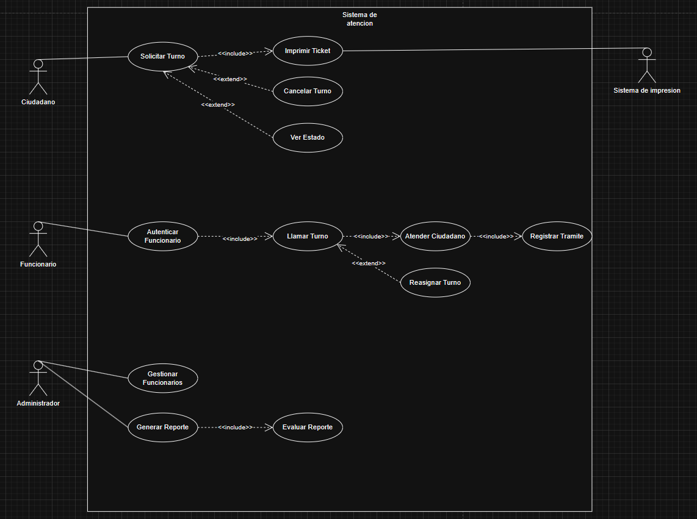
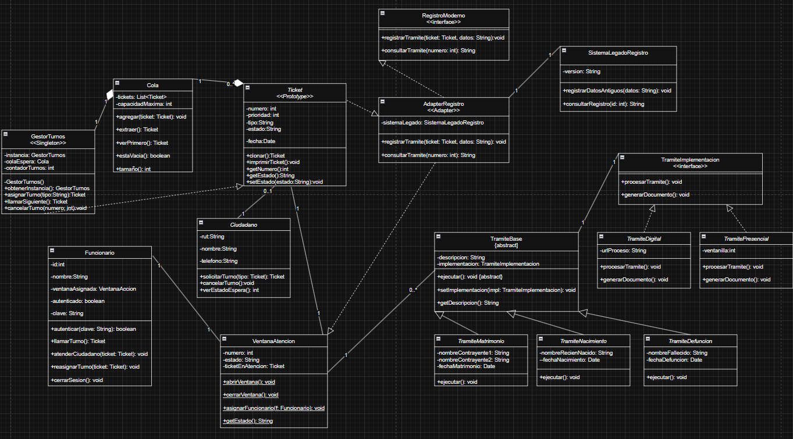
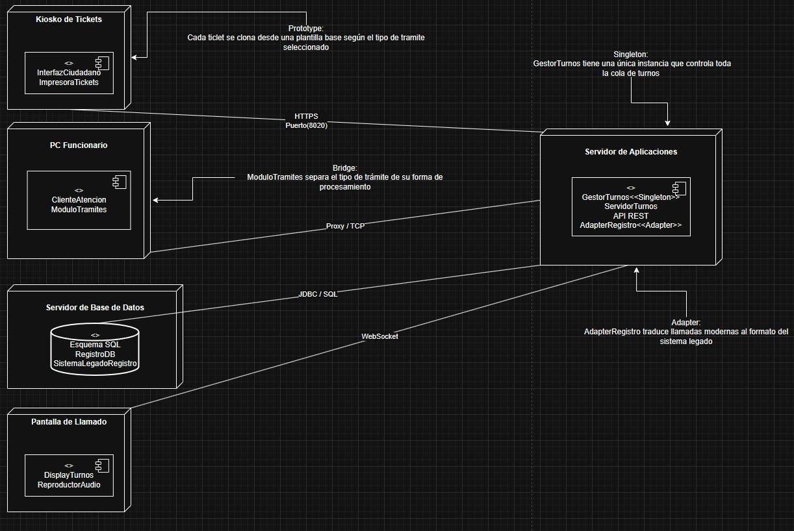

# Sistema Gestion de Turnos Digitales Tunomatico
El proyecto consiste en el modelado completo de uns sistema de gestion de turnos digitales aplicado al modelo de un registro civil orientado a optimizar el proceso de atención ciudadana mediante la asignacion y gestion de turnos a través de tickets físicos. el sistema aborda la problemática de las largas filas de espera y la desorganización en la atención presencial 

El diseño del sistema aplica patrones de diseño reconocidos de la clasificación Gang of Four(GoF), especialmente los patrones Singleton, Prototype, Adapter y Bridge
## Diagrama de Casos de Uso

El diagrama de caso de uso representa la visión funcional del sistema de gestión, modelando las interacciones entre los actores externos y las funcionalidades del sistema

En este diagrama de identifican cuatro actores siendo estos:
Ciudadano,Funcionario,Administrador y Sistema de Impresion  

Siendo actores primarios -Ciudadano, -Funcionario y -Administrador
ya que ellos inician el flujo del sistema y tienen un objetivo que cumplir sin ellos, el caso de uso no ocurre

Y como actor secundario el Sistema de Impresión
Ya que debe esperar a ser llamado y solo reacciona cuando el sistema lo necesita

### Actores

| Actor | Tipo | Casos de Uso que inicia |
|---|---|---|
| Ciudadano | Primario | Solicitar Turno |
| Funcionario | Primario | Autenticar Funcionario → Llamar Turno |
| Administrador | Primario | Gestionar Funcionarios, Generar Reporte |
| Sistema de Impresión | Secundario | Imprimir Ticket (invocado por el sistema) |

### Relaciones

| Caso de Uso Base | Relación | Caso de Uso Extendido | Justificación |
|---|---|---|---|
| Solicitar Turno | `<<include>>` | Imprimir Ticket | Siempre obligatorio al solicitar turno |
| Solicitar Turno | `<<extend>>` | Cancelar Turno | Opcional, solo si el ciudadano abandona la espera |
| Solicitar Turno | `<<extend>>` | Ver Estado | Opcional, el ciudadano puede o no consultarlo |
| Autenticar Funcionario | `<<include>>` | Llamar Turno | Requisito obligatorio para operar el sistema |
| Llamar Turno | `<<include>>` | Atender Ciudadano | Siempre se atiende tras llamar el turno |
| Atender Ciudadano | `<<include>>` | Registrar Trámite | Toda atención debe quedar registrada |
| Llamar Turno | `<<extend>>` | Reasignar Turno | Opcional, solo si el ciudadano no se presenta |
| Generar Reporte | `<<include>>` | Evaluar Reporte | Siempre se evalúa al generar un reporte |

## Diagrama de Clases

### Relaciones y Cardinalidad

| Clase Origen | Relación | Clase Destino | Cardinalidad |
|---|---|---|---|
| GestorTurnos | gestiona | Cola | 1 a 1 |
| GestorTurnos | gestiona | Ticket | 1 a muchos |
| Ticket | pertenece a | Ciudadano | muchos a 1 |
| Ticket | asignado a | VentanaAtencion | muchos a 1 |
| AdapterRegistro | implementa | RegistroModerno | realización |
| AdapterRegistro | delega | SistemaLegadoRegistro | dependencia 1 a 1 |
| TramiteBase | contiene | TramiteImplementacion | composición 1 a 1 |
| TramiteNacimiento / TramiteDefuncion / TramiteMatrimonio | hereda | TramiteBase | herencia |
| TramitePresencial / TramiteDigital | hereda | TramiteImplementacion | herencia |

### Patrones Aplicados

| Patrón | Clase principal | Propósito |
|---|---|---|
| Singleton | GestorTurnos | Una sola instancia del gestor |
| Prototype | Ticket | Clonar tickets base para alta demanda |
| Adapter | AdapterRegistro | Integrar sistema legado con sistema moderno |
| Bridge | TramiteBase + TramiteImplementacion | Separar tipo de trámite de su forma de procesamiento |

### Singleton — GestorTurnos
**Problema que resuelve:** múltiples instancias del gestor provocarían
duplicación de números de turno y corrupción de la cola.

**Solución:** una única instancia centralizada controla toda la lógica
de asignación y llamado de turnos.

**Implementación:**
- Constructor privado → impide instanciación externa
- Atributo estático `instancia` → almacena la única instancia
- Método `obtenerInstancia()` → verifica existencia antes de crear

**Por qué es crítico:** con múltiples funcionarios operando en simultáneo,
la coherencia del estado global es un requerimiento no negociable.

---

### Prototype — Ticket
**Problema que resuelve:** en períodos de alta demanda, instanciar tickets
desde cero en cada solicitud es costoso e inconsistente.

**Solución:** clonar una plantilla base preconfigurada según el tipo de trámite.

**Implementación:**
- Método `clonar()` → produce una copia independiente del ticket base
- Cada tipo de trámite tiene su propia plantilla predefinida

**Por qué es crítico:** permite incorporar nuevos tipos de trámite
sin modificar la lógica de creación existente.

---

### Adapter — AdapterRegistro
**Problema que resuelve:** el sistema moderno y el sistema legado hablan
"idiomas" distintos y el legado no puede modificarse.

**Solución:** AdapterRegistro traduce las llamadas modernas al formato
que acepta SistemaLegadoRegistro.

**Implementación:**
- Implementa la interfaz `RegistroModerno`
- Internamente llama a `registrarDatosAntiguos(datos: String)` del legado

**Por qué es crítico:** cumple el principio Abierto/Cerrado, ninguno
de los dos sistemas extremos necesita modificarse.

---

### Bridge — TramiteBase + TramiteImplementacion
**Problema que resuelve:** sin Bridge se necesitarían 6 clases concretas
para combinar 3 tipos de trámite × 2 formas de procesamiento.

**Solución:** separar la jerarquía del tipo de trámite de la jerarquía
de la forma de procesamiento.

**Implementación:**
- `TramiteBase` (abstract) → TramiteNacimiento, TramiteDefuncion, TramiteMatrimonio
- `TramiteImplementacion` (interface) → TramitePresencial, TramiteDigital
- Método `setImplementacion()` → combina ambas dimensiones en tiempo de ejecución

**Por qué es crítico:** un nuevo tipo de procesamiento (ej: TramiteRemoto)
no requiere modificar ninguna clase de trámite existente.

## Diagrama de Implementación

### Nodos y Conexiones

| Nodo Origen | Protocolo | Nodo Destino |
|---|---|---|
| Kiosco de Tickets | HTTPS :8020 | Servidor de Aplicaciones |
| PC Funcionario | Proxy/TCP | Servidor de Aplicaciones |
| Pantalla de Llamado | WebSocket | Servidor de Aplicaciones |
| Servidor de Aplicaciones | JDBC/SQL | Servidor de Base de Datos |

### Componentes por Nodo

| Nodo | Componentes |
|---|---|
| Kiosco de Tickets | UI ciudadano, módulo de impresión |
| PC Funcionario | Cliente de atención |
| Servidor de Aplicaciones | GestorTurnos (Singleton), API REST, AdapterRegistro |
| Servidor de Base de Datos | Base de datos, SistemaLegadoRegistro |
| Pantalla de Llamado | Display turnos en tiempo real |

### Kiosco de Tickets → Servidor : HTTPS Puerto 8020
- **HTTPS** protege los datos del ciudadano en tránsito
- **Puerto 8020** segrega el tráfico del kiosco del tráfico web convencional
- El kiosco opera como **cliente liviano**, toda la lógica reside en el servidor
- Evita exponer lógica crítica en un dispositivo de acceso público

---

### PC Funcionario → Servidor : Proxy/TCP
- El **proxy** centraliza autenticación y auditoría de operaciones
- Permite aplicar **políticas de seguridad** y balanceo de carga
- Facilita la **trazabilidad** de acciones por funcionario
- Al ser red interna institucional, el proxy es la capa de control adecuada

---

### Servidor de Aplicaciones — Nodo Central
- Concentra toda la **lógica de negocio** en un único nodo controlado
- **API REST** permite interoperabilidad con cualquier tipo de cliente
- **GestorTurnos como Singleton** garantiza coherencia del estado global
- **AdapterRegistro** media la comunicación con el sistema legado

---

### Pantalla de Llamado → Servidor : WebSocket
- **WebSocket** mantiene conexión persistente bidireccional
- El servidor **notifica en tiempo real** sin necesidad de polling
- Garantiza **latencia mínima** al mostrar número de turno y ventanilla
- HTTP convencional no es adecuado por su naturaleza solicitud-respuesta

---

### Servidor de Aplicaciones → Base de Datos : JDBC/SQL
- Estándar en **arquitecturas Java empresariales**
- Compatible con múltiples motores de base de datos relacionales
- La **separación física** de ambos servidores permite escalar
  o migrar la BD sin afectar la capa de aplicación
- **SistemaLegadoRegistro** vive en este nodo y es mediado
  por AdapterRegistro desde el servidor de aplicaciones

---

### Conclusión
El modelado logra representar un sistema real de gestión de turnos
con decisiones de diseño fundamentadas, aplicación correcta de
patrones y una arquitectura distribuida coherente. La trazabilidad
entre los tres diagramas garantiza que el modelo sea implementable
y mantenible a largo plazo.

### Limitaciones identificadas
- El Diagrama de Clases no modela explícitamente la gestión de
  excepciones ni los estados de error del sistema.
- El Diagrama de Implementación no contempla redundancia de
  servidores ni estrategias de alta disponibilidad.
- El Diagrama de Casos de Uso no detalla flujos alternativos
  internos como tiempo de espera máximo o turnos prioritarios.
  
